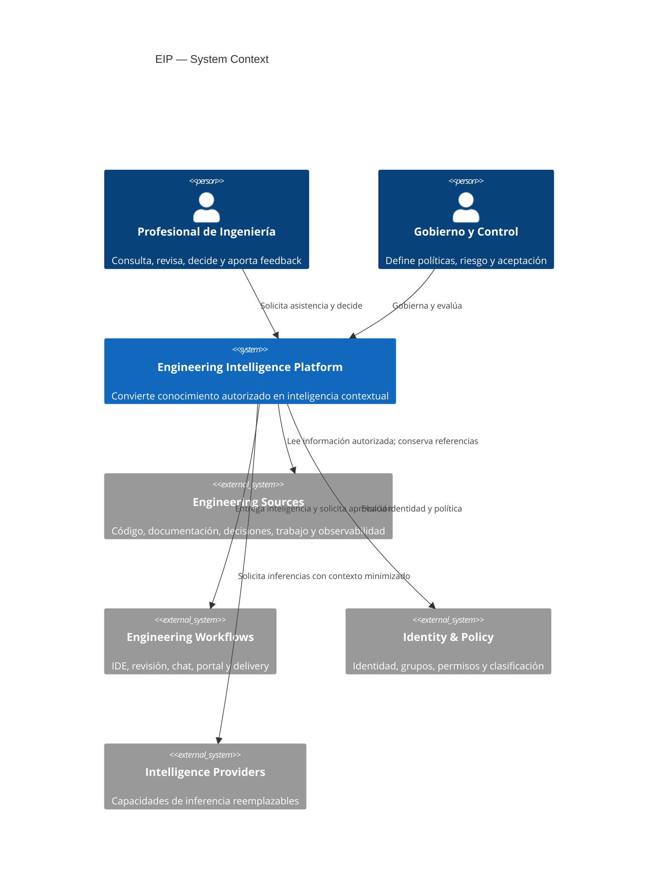
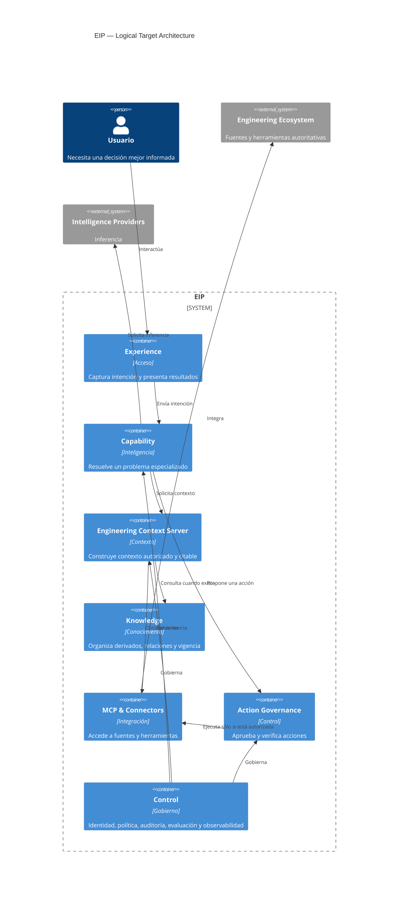
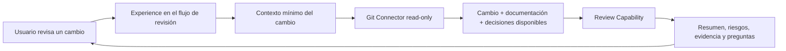
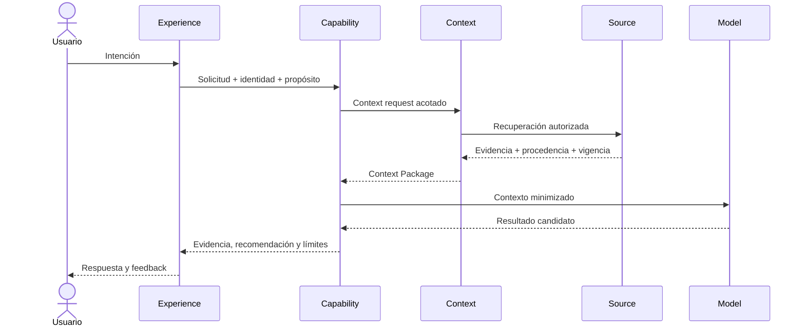

# Engineering Intelligence Platform — Architecture v1.0

| Campo               | Valor                                                                             |
| ------------------- | --------------------------------------------------------------------------------- |
| Documento           | 001 — Arquitectura de la plataforma                                               |
| Versión             | 1.0                                                                               |
| Estado              | **Accepted**                                                                      |
| Owner               | Engineering Platform                                                              |
| Audiencia           | Engineering Leadership, Architects, Tech Leads, Platform Engineers, SRE, Security |
| Aprobación          | Accepted with changes incorporados                                                |
| Fecha de aceptación | 1 de agosto de 2026                                                               |
| Fuente normativa    | Engineering Intelligence Platform — Product Vision v1.1                           |
| Reemplaza           | Ningún documento; es la primera arquitectura canónica de EIP                      |

> **Idea central:** EIP no reemplaza herramientas. EIP genera inteligencia a
> partir del conocimiento autorizado que esas herramientas contienen.

Este documento es la arquitectura oficial de EIP. Está pensado para leerse en
20–30 minutos. El diseño ampliado se conserva en
[Detailed Architecture Reference](./reference/engineering-intelligence-platform-architecture-v1.0-detailed-reference.md).

---

## 1. Executive Summary

Las organizaciones de ingeniería producen conocimiento en repositorios,
documentación, decisiones, catálogos, sistemas de trabajo y plataformas
operativas. Esas fuentes permanecen autoritativas, pero su fragmentación obliga
a buscar información, reconstruir contexto y repetir análisis.

La **Engineering Intelligence Platform (EIP)** es una capa transversal que
convierte ese conocimiento autorizado en contexto e inteligencia accionable. EIP
no es un nuevo sistema de registro, no reemplaza el juicio humano y no comienza
por automatizar. Primero ayuda a comprender; luego recomienda con evidencia;
sólo después puede preparar o ejecutar acciones de bajo impacto bajo políticas
explícitas.

La arquitectura distingue responsabilidades estables:

- **Experience:** recibe la intención y presenta evidencia, recomendaciones y
  aprobaciones.
- **Engineering Context Server:** obtiene y arma el contexto mínimo, relevante,
  autorizado y citable.
- **Knowledge:** organiza conocimiento derivado cuando un vertical slice
  demuestra que hace falta.
- **Capability:** resuelve un problema de ingeniería específico y medible.
- **MCP & Connectors:** integran fuentes y herramientas sin transferirles
  autoridad.
- **Control:** aplica identidad, políticas, evaluación, auditoría y
  observabilidad.

Estos elementos describen una arquitectura objetivo, no un backlog. **No se
construyen todos desde el inicio.** EIP evoluciona mediante vertical slices
completos que entregan valor real.

---

## 2. Visión, misión y drivers

### 2.1 Visión

Que cada decisión de ingeniería pueda partir del conocimiento colectivo
relevante, disponible de forma inmediata, contextual, confiable y explicable.

### 2.2 Misión arquitectónica

Reducir carga cognitiva transformando conocimiento disperso en inteligencia
accionable sin reemplazar fuentes oficiales, herramientas existentes ni
responsabilidad humana.

### 2.3 Drivers

| Driver                                | Respuesta arquitectónica                                     |
| ------------------------------------- | ------------------------------------------------------------ |
| Menos tiempo buscando información     | Recuperación contextual dentro del flujo de trabajo          |
| Revisiones más rápidas y consistentes | Capabilities especializadas con Definition of Done medible   |
| Menos errores repetidos               | Evidencia histórica, relaciones y feedback gobernado         |
| Preservar conocimiento                | Procedencia, ownership, vigencia y ciclo de vida             |
| Mejor onboarding                      | Descubrimiento seguro de sistemas, decisiones y responsables |
| Mejor respuesta ante incidentes       | Contexto correlacionado, no reemplazo de observabilidad      |
| Adopción por valor                    | Vertical slices y outcomes, no infraestructura anticipada    |

### 2.4 Atributos de calidad

En orden de prioridad: confianza, seguridad y privacidad, auditabilidad,
interoperabilidad, evolución, resiliencia, usabilidad y eficiencia.

Cuando frescura, costo y confiabilidad entren en conflicto, EIP debe priorizar
confiabilidad y declarar la antigüedad o ausencia de evidencia.

---

## 3. Principios de arquitectura

1. **Context over models.** El modelo es reemplazable; el contexto autorizado,
   vigente y trazable es el activo durable.
2. **Intelligence over automation.** Primero comprender y recomendar. La
   automatización aparece después de demostrar confianza y valor.
3. **Sources remain authoritative.** Las herramientas existentes conservan
   ownership; EIP mantiene referencias y derivados reconstruibles.
4. **Human accountability.** La plataforma propone; las personas deciden y
   conservan responsabilidad.
5. **Specialized capabilities.** Se prefieren capacidades acotadas, evaluables y
   con owner frente a un agente universal.
6. **Separate context, reasoning and action.** Obtener información, recomendar y
   ejecutar son etapas con controles diferentes.
7. **Evidence first.** Toda afirmación material distingue hechos, inferencias y
   recomendaciones, e incluye fuentes y límites.
8. **Least privilege and purpose.** El acceso se limita por identidad, propósito
   y sensibilidad.
9. **Modular first.** Los límites son lógicos; la separación física requiere
   evidencia.
10. **Vertical slices before infrastructure.** Se construye valor end-to-end
    antes de generalizar plataforma.
11. **Governed learning.** Feedback e interacciones son señales, no verdad
    automática.
12. **Observable outcomes.** La cantidad de agentes no es una métrica de éxito.

---

## 4. Anti-Goals

EIP explícitamente **no intenta**:

- reemplazar repositorios Git, CI/CD, observabilidad, documentación, tickets,
  chat, IDE o portales;
- convertirse en otro catálogo o portal generalista;
- copiar o almacenar todo el conocimiento de la organización;
- crear una fuente de verdad paralela;
- centralizar conocimiento tácito sin ownership;
- construir infraestructura genérica antes de validar un caso de uso;
- crear un agente universal;
- ejecutar automáticamente cambios en producción;
- imponer adopción como gate obligatorio;
- evaluar productividad individual;
- prescribir proveedores, modelos o tecnologías;
- maximizar autonomía, datos o cantidad de capabilities.

Una propuesta que acerque EIP a estos anti-goals requiere reformulación o un ADR
que modifique expresamente esta arquitectura.

---

## 5. C4 — System Context

Dentro de EIP están la construcción de contexto, la inteligencia especializada,
los derivados de conocimiento, los controles específicos y la evaluación. Fuera
permanecen las fuentes de verdad, identidad corporativa, canales de trabajo y
proveedores de modelos.

---

## 6. C4 — Logical Containers

Los siguientes son contenedores lógicos. No implican servicios, repositorios o
despliegues separados.

El diagrama muestra el destino conceptual. La arquitectura evolutiva determina
qué existe en cada fase. Ningún bloque autoriza por sí mismo su construcción.

---

## 7. Capability Model y bounded contexts

Una capability es una unidad de valor, no un servicio ni un agente. Tiene
problema, usuarios, resultado, evidencia, owner, riesgo y Definition of Done.

| Contexto               | Responsabilidad                                       | No hace                                         |
| ---------------------- | ----------------------------------------------------- | ----------------------------------------------- |
| Source Integration     | Adapta fuentes a contratos canónicos                  | No decide relevancia ni verdad                  |
| Knowledge Lifecycle    | Gestiona derivados, relaciones, provenance y vigencia | No recomienda                                   |
| Context Assembly       | Construye contexto autorizado y mínimo                | No muta fuentes                                 |
| Intelligence Execution | Ejecuta capabilities y produce resultados             | No concede permisos                             |
| Action Governance      | Clasifica, aprueba y verifica efectos                 | No decide conveniencia por sí solo              |
| Trust & Policy         | Aplica identidad, propósito y restricciones           | No define lógica de dominio                     |
| Evaluation & Feedback  | Evalúa calidad, seguridad, utilidad y outcomes        | No convierte feedback en verdad                 |
| Audit & Evidence       | Permite reconstruir decisiones y efectos              | No almacena indiscriminadamente datos sensibles |

Estos límites se mantienen aunque inicialmente compartan un despliegue.

---

## 8. Arquitectura Evolutiva

### Fase 0 — Primer vertical slice

Existe únicamente:

- un punto de **Experience** dentro de un flujo existente;
- un **Engineering Context Server** mínimo;
- un **Git Connector** de sólo lectura;
- una primera capability integrada en el slice;
- controles mínimos de identidad, citas, auditoría y evaluación.

No existen todavía Knowledge Platform general, Agent Platform general, Event
Backbone, Action Gateway, múltiples agentes ni automatización.

### Fase 1 — Conocimiento reutilizable

Se agrega Knowledge sólo cuando recuperar directamente desde Git deja de ser
suficiente o un segundo caso necesita reutilizar entidades, relaciones o
derivados.

### Fase 2 — Primera capability formal

Review Capability se separa conceptualmente, obtiene owner, contrato,
evaluaciones y lifecycle. Se demuestra especialización antes de crear una
plataforma general de agentes.

### Fase 3 — Segunda fuente o dominio

Se incorpora observabilidad u otra fuente priorizada mediante un nuevo vertical
slice. La asincronía aparece sólo si existe necesidad real.

### Fase 4 — Plataforma compartida

Agent Platform, MCP Registry, Action Governance u otros servicios compartidos
nacen sólo cuando varias capabilities exhiben duplicación, controles o escalas
incompatibles.

Una fase avanza cuando cumple su Definition of Done, demuestra outcome y revela
una limitación real; no cuando “está programada”.

---

## 9. Vertical Slice Strategy

Nunca construimos primero Context Server, Knowledge Platform, Agent Runtime o
integración genérica. Construimos una capacidad completa y extraemos
infraestructura cuando aparece reutilización comprobada.

El slice se elige por dolor frecuente, outcome medible, evidencia accesible,
riesgo controlable, owner claro y capacidad de aprender sobre Context.

Una pieza se extrae como capacidad compartida cuando al menos dos slices
necesitan el mismo comportamiento, su variabilidad es entendida y separarla
reduce costo o riesgo.

---

## 10. Componentes conceptuales

### 10.1 Engineering Context Server

Transforma una solicitud con identidad y propósito en un **Context Package**
mínimo, relevante, autorizado, vigente y citable. Resuelve entidades, recupera y
rankea evidencia, declara faltantes y contradicciones, y respeta límites de
contexto, costo y retención.

No es fuente de verdad, no ejecuta acciones, no decide la recomendación final y
no eleva permisos. En Fase 0 puede ser una responsabilidad pequeña dentro del
slice.

### 10.2 MCP & Integration

MCP es el límite preferido para recursos y herramientas aptos para capabilities,
pero el primer conector no requiere una plataforma general. Evoluciona desde un
adaptador read-only a contratos compartidos, registro gobernado y —sólo antes de
mutaciones— Action Governance.

### 10.3 Agent Platform

Un agente es una capability especializada con objetivo, entradas, herramientas,
presupuesto, políticas, evaluación y owner. Agent Platform no se construye en
Fase 0; aparece cuando varias capabilities necesitan routing, model gateway,
tool broker, sesiones o guardrails comunes.

| Nivel | Alcance                                   | Estado v1.0                    |
| ----- | ----------------------------------------- | ------------------------------ |
| L0    | Recupera y resume evidencia               | Permitido                      |
| L1    | Recomienda sin ejecutar                   | Permitido con evaluación       |
| L2    | Prepara acción o borrador                 | Futuro, con revisión humana    |
| L3    | Ejecuta acción reversible de bajo impacto | Futuro, opt-in                 |
| L4    | Ejecuta acciones de alto impacto          | Fuera de alcance; requiere ADR |

### 10.4 Knowledge Platform

Knowledge organiza derivados sin convertirse en fuente autoritativa. Sus
conceptos mínimos son Artifact, Entity, Relationship, Assertion y Feedback
Signal. Cada elemento conserva fuente, versión, tiempo, owner, sensibilidad y
vigencia. Ante conflicto muestra la contradicción o aplica precedencia
gobernada.

Knowledge nace sólo cuando la recuperación directa no alcanza, existe
reutilización real o se necesitan relaciones y lifecycle compartidos.

---

## 11. Capability Evolution

Una capability nace sólo si existe un problema verificable, usuario y owner,
outcome observable, evidencia autorizable, hipótesis medible, riesgo definido y
un vertical slice validable.

Lifecycle: `proposed` → `experiment` → `limited` → `accepted` → `deprecated` →
`retired`.

Se divide cuando responsabilidades difieren materialmente en usuarios, fuentes,
políticas, riesgo, métricas, ciclo u owner. Se fusiona cuando resuelve el mismo
outcome y la separación confunde sin aportar aislamiento. Se retira cuando no
alcanza el outcome, pierde uso, duplica otra capacidad, sus fuentes dejan de ser
confiables o su costo/riesgo supera el beneficio.

---

## 12. Definition of Done

Una capability no está terminada cuando está programada. Está terminada cuando:

- problema, usuario, owner y outcome están documentados;
- entradas, salidas y límites son explícitos;
- usa fuentes autorizadas y cita evidencia;
- distingue hechos, inferencias, recomendaciones y ausencias;
- respeta identidad, propósito y sensibilidad;
- alcanza umbrales acordados de calidad y seguridad;
- tiene evaluaciones offline y señales online;
- latencia y costo son adecuados;
- falla de forma segura y explica degradaciones;
- es auditable y puede deshabilitarse;
- tiene política de feedback, retención, rollback y retiro;
- demuestra un outcome, no sólo actividad técnica.

### DoD inicial — Review Capability

- resume el cambio y su intención con evidencia;
- encuentra documentación y decisiones relacionadas;
- detecta riesgos materiales y explica por qué;
- señala información faltante o contradictoria;
- propone qué observar sin inventar dashboards;
- genera preguntas útiles para autor y reviewer;
- separa hallazgos confirmados de hipótesis;
- cita cada afirmación material;
- se abstiene cuando el contexto no alcanza;
- reduce de forma medible tiempo o carga de revisión;
- no bloquea ni modifica el cambio automáticamente.

Los umbrales cuantitativos son una decisión pendiente del piloto.

---

## 13. Event Architecture y Data Flows

Los eventos se introducen sólo cuando cambios, trabajos largos o invalidación
requieren desacoplamiento. No existe Event Backbone en las primeras fases por
defecto. Deben describir hechos, ser versionados, correlacionables y tolerar
duplicados y reordenamiento. Un replay nunca repite efectos externos sin
protección.

Las acciones futuras atraviesan clasificación, política, aprobación, ejecución
con alcance mínimo, verificación y auditoría. El feedback se conserva como señal
separada, no como conocimiento publicado.

---

## 14. Trust, Security and Privacy

Usuario, capability, modelo, conector, fuente y contenido son independientes y
no confiables por defecto. Ninguno hereda autoridad por pertenecer a EIP.

Controles invariantes:

- identidad humana y de workload verificable;
- autorización deny-by-default y mínimo privilegio;
- políticas por propósito, sensibilidad, región y proveedor;
- credenciales fuera de agentes y modelos;
- filtrado antes de indexación, inferencia y salida;
- protección frente a prompt injection y tool abuse;
- retención y eliminación coherentes en derivados;
- auditoría resistente a alteraciones;
- intervención humana ante baja confianza, conflicto o alto impacto.

La confianza de una salida combina autoridad, frescura, cobertura, recuperación,
inferencia y madurez de evaluación; no se reduce obligatoriamente a un
porcentaje único.

---

## 15. Observability, Evaluation and Deployment

EIP observa salud técnica, calidad de conocimiento, calidad de inteligencia y
outcomes de producto. Cada ejecución vincula identidad efectiva, propósito,
políticas, versiones, modelo, herramientas, costo, resultado y feedback sin
almacenar indiscriminadamente contenido sensible.

Las promociones requieren evaluación offline, online, outcomes y pruebas
adversariales. Los SLO se fijan después del baseline.

El despliegue inicial es un producto modular con los mínimos deployables del
slice. Una separación física exige escala incompatible, frontera regulatoria,
blast radius, continuidad diferente, ciclos independientes u ownership
sostenible.

La resiliencia mínima incluye timeouts, límites, aislamiento, degradación
explícita, caché autorizada y kill switch. EIP no se vuelve dependencia crítica
de producción sin ADR.

---

## 16. Governance

| Rol                 | Responsabilidad                         |
| ------------------- | --------------------------------------- |
| Product Owner       | Outcomes, priorización y adopción       |
| Architecture Owner  | Coherencia, límites y ADR               |
| Capability Owner    | Calidad, riesgo, evaluación y lifecycle |
| Source Owner        | Autoridad, acceso y calidad de fuente   |
| Knowledge Steward   | Taxonomía, vigencia y conflictos        |
| Security/Risk Owner | Políticas, threat model y riesgo        |
| Human Approver      | Autoridad contextual sobre una acción   |

Requieren ADR: nuevo bounded context; cambio de autoridad; nueva clase de
acción; mayor autonomía; nueva categoría sensible; cambio del trust model;
dependencia crítica; o excepción duradera a un principio/anti-goal.

Architecture v1.0 queda cerrada con esta aceptación. Evoluciona únicamente
mediante un ADR que demuestre una necesidad arquitectónica.

---

## 17. ADRs

| ADR     | Decisión                                                      | Trade-off aceptado                             |
| ------- | ------------------------------------------------------------- | ---------------------------------------------- |
| ADR-001 | EIP es capa de inteligencia, no fuente de verdad              | Dependencia de fuentes y consistencia eventual |
| ADR-002 | Contexto, razonamiento y acción separados                     | Más coordinación                               |
| ADR-003 | Capabilities especializadas sobre plataforma común            | Routing y posible solapamiento                 |
| ADR-004 | Human-in-the-loop y autonomía progresiva                      | Automatización más lenta                       |
| ADR-005 | MCP como límite preferido cuando exista plataforma compartida | Adaptadores y capa adicional                   |
| ADR-006 | Modular first                                                 | Menor independencia inicial                    |
| ADR-007 | Evidence-first y confianza multidimensional                   | Mayor carga de metadatos y UX                  |
| ADR-008 | Aprendizaje gobernado, no memoria automática                  | Actualización más lenta                        |
| ADR-009 | Modelos reemplazables detrás de un límite gobernado           | Menor acceso a funciones propietarias          |
| ADR-010 | Eventos sólo cuando el desacoplamiento lo justifique          | Dos estilos de interacción                     |
| ADR-011 | Evolución mediante vertical slices                            | Menos infraestructura anticipada               |
| ADR-012 | Capability lifecycle y DoD por outcome                        | Mayor disciplina de producto                   |

---

## 18. Risks and Trade-offs

| Riesgo                      | Respuesta                                                 |
| --------------------------- | --------------------------------------------------------- |
| Recomendaciones incorrectas | Evidencia, evaluación, abstención y revisión humana       |
| Información obsoleta        | Vigencia, precedencia, conflictos visibles e invalidación |
| Exposición de datos         | Autorización contextual, minimización y auditoría         |
| Prompt injection/tool abuse | Datos no confiables, allowlists y separación de acción    |
| Automatización prematura    | Niveles de autonomía y gates                              |
| Baja adopción               | Vertical slices dentro del flujo y outcomes               |
| Scope creep                 | Anti-goals, lifecycle y priorización por problema         |
| Lock-in y costos            | Límites reemplazables, presupuestos y evaluación          |
| Complejidad anticipada      | Extracción sólo tras reutilización comprobada             |
| EIP crítica accidentalmente | ADR antes de volverla obligatoria                         |

Trade-off rector: EIP acepta menor velocidad aparente de plataforma a cambio de
aprender más rápido sobre el producto real.

---

## 19. Roadmap

| Horizonte | Resultado                          | Arquitectura que puede existir                                 |
| --------- | ---------------------------------- | -------------------------------------------------------------- |
| Fase 0    | Primer problema validado read-only | Experience + Context mínimo + Git Connector + capability local |
| Fase 1    | Contexto reutilizable demostrado   | Knowledge mínimo extraído del slice                            |
| Fase 2    | Review repetible y evaluada        | Capability formal con owner y lifecycle                        |
| Fase 3    | Segundo dominio/fuente validado    | Nueva integración; asincronía si hace falta                    |
| Fase 4    | Patrones compartidos comprobados   | Agent/MCP/Action/Control según evidencia                       |

La siguiente iniciativa es diseñar Engineering Context Server dentro del primer
vertical slice, no como plataforma genérica aislada.

---

## 20. Assumptions, Pending Decisions, Risks and Open Questions

### Suposiciones

- **A-01:** existe una fuente Git autorizable para el primer slice.
- **A-02:** identidad y permisos pueden propagarse hasta la recuperación.
- **A-03:** una capability read-only puede demostrar valor temprano.
- **A-04:** los owners mantendrán autoridad sobre sus fuentes.
- **A-05:** la organización puede clasificar datos y autorizar modelos.

### Decisiones pendientes

- **PD-01:** caso de uso y usuario exactos del primer slice.
- **PD-02:** fuente Git inicial y artefactos incluidos.
- **PD-03:** DoD cuantitativa y baseline.
- **PD-04:** modelo de aislamiento y categorías de datos.
- **PD-05:** proveedor/modelo permitido por sensibilidad.
- **PD-06:** canal de Experience inicial.
- **PD-07:** owner de Review Capability.
- **PD-08:** SLO, costo y umbrales tras el piloto.

### Riesgos abiertos

- **R-01:** elegir un problema visible pero poco valioso.
- **R-02:** baja calidad de fuente limita groundedness.
- **R-03:** abstraer Context Server demasiado pronto recrea waterfall.
- **R-04:** confundir una buena demo con una capability operable.

### Preguntas abiertas

- **OQ-01:** ¿qué flujo combina mayor dolor, frecuencia y bajo riesgo?
- **OQ-02:** ¿qué documentación o ADR puede relacionarse de forma confiable?
- **OQ-03:** ¿qué evidencia necesita un reviewer sin sobrecarga?
- **OQ-04:** ¿cómo medir tiempo ahorrado sin vigilancia individual?
- **OQ-05:** ¿qué limitación obligará a extraer Knowledge?

---

## 21. Consecuencias y registro

Esta aceptación establece que EIP comienza con un vertical slice read-only; la
arquitectura objetivo no equivale a componentes a construir; ninguna plataforma
compartida nace antes de una necesidad repetida; toda capability tiene lifecycle
y DoD por outcome; y el siguiente diseño se enfoca en Engineering Context Server
dentro del primer slice.

| Fecha      | Cambio                                                                                                               | Resultado                     |
| ---------- | -------------------------------------------------------------------------------------------------------------------- | ----------------------------- |
| 2026-07-31 | Primera propuesta completa                                                                                           | `Proposed`                    |
| 2026-08-01 | Revisión CTO: arquitectura evolutiva, Capability Evolution, Anti-Goals, Vertical Slice Strategy y Definition of Done | `Accepted`                    |
| 2026-08-02 | Regeneración tras pérdida de archivos temporales                                                                     | Contenido canónico restaurado |
