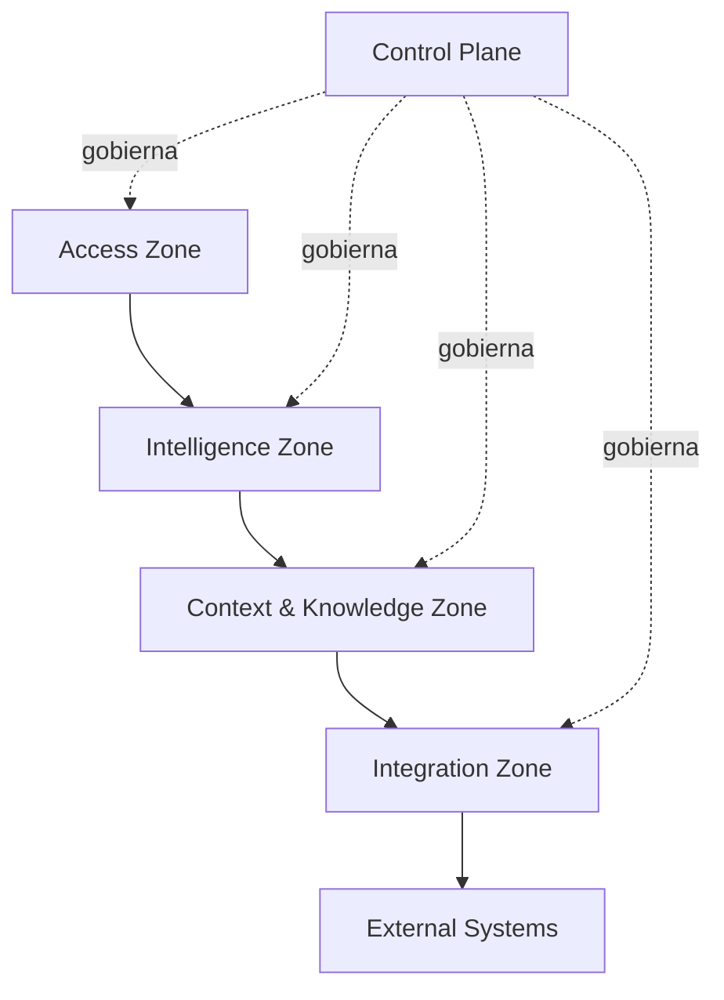

# Engineering Intelligence Platform — Architecture v1.0 — Detailed Reference

| Campo               | Valor                |
| ------------------- | -------------------- |
| Versión             | 1.0                  |
| Estado              | Supporting Reference |
| Owner               | Engineering Platform |
| Última regeneración | 2 de agosto de 2026  |

> **Relación normativa:** este documento amplía el diseño y las decisiones de la
> primera propuesta. La arquitectura normativa es
> [Engineering Intelligence Platform — Architecture v1.0](../engineering-intelligence-platform-architecture-v1.0.md).
> Ante contradicción, prevalece el documento oficial.

---

## 1. Propósito

Conservar el razonamiento detallado que respalda Architecture v1.0 sin
sobrecargar el documento canónico. Esta referencia no agrega componentes
obligatorios ni reemplaza el enfoque evolutivo basado en vertical slices.

Lenguaje normativo:

- `DEBE` y `NO DEBE`: invariante arquitectónico.
- `DEBERÍA` y `NO DEBERÍA`: recomendación fuerte sujeta a trade-off explícito.
- `PUEDE`: opción permitida, no compromiso.

Clasificación de incertidumbre:

- **Suposición:** hipótesis necesaria para avanzar.
- **Decisión pendiente:** elección que necesita evidencia o autoridad.
- **Riesgo:** condición capaz de afectar outcomes.
- **Pregunta abierta:** información aún no disponible.

---

## 2. Invariantes

- Los sistemas integrados siguen siendo autoritativos sobre sus datos.
- Toda afirmación material DEBE vincularse con evidencia y procedencia.
- La autorización de una acción NO DEBE delegarse al modelo que la propone.
- El contexto NO DEBE exceder los permisos efectivos ni el propósito.
- El conocimiento derivado NO DEBE presentarse como hecho fuente.
- Una capability degradada DEBE fallar de forma segura y visible.
- El aprendizaje NO DEBE convertir automáticamente una interacción en verdad.
- Sustituir modelos o proveedores NO DEBERÍA alterar límites de dominio.
- La arquitectura objetivo NO DEBE interpretarse como backlog.
- La infraestructura compartida NO DEBE anticiparse a patrones comprobados.

---

## 3. Quality Attributes

### Confiabilidad

Las respuestas deben mostrar evidencia, antigüedad, cobertura y límites. Cuando
el contexto sea insuficiente, la abstención es un resultado correcto.

### Seguridad y privacidad

Identidad, propósito, sensibilidad y política limitan recuperación, inferencia,
salida y acción. Tener acceso técnico no implica uso apropiado para cualquier
tarea.

### Auditabilidad

Debe ser posible reconstruir solicitud, identidad efectiva, contexto, fuentes,
políticas, versiones, herramientas, modelos, aprobaciones y efectos sin
registrar indiscriminadamente contenido sensible.

### Interoperabilidad

Fuentes, herramientas y modelos se encapsulan detrás de contratos. Las
extensiones específicas permanecen explícitas y no contaminan el núcleo.

### Evolucionabilidad

Bounded contexts son límites lógicos. La separación física requiere evidencia de
escala, seguridad, blast radius, continuidad u ownership.

### Resiliencia

Las fallas externas deben aislarse. EIP puede degradar a evidencia parcial o
búsqueda sin inferencia, siempre declarando cobertura.

### Eficiencia

Se busca el contexto mínimo suficiente. Más contexto aumenta costo, latencia y
exposición, y no garantiza mejor respuesta.

---

## 4. Logical Planes

La arquitectura objetivo puede describirse mediante seis planos:

1. **Experience Plane:** acceso dentro de flujos existentes.
2. **Intelligence Plane:** capabilities especializadas.
3. **Context Plane:** resolución y ensamblado de contexto.
4. **Knowledge Plane:** derivados, relaciones, procedencia y lifecycle.
5. **Integration Plane:** MCP y conectores.
6. **Control Plane:** identidad, políticas, auditoría, evaluación y
   observabilidad.

Estos planos no equivalen a aplicaciones o equipos. En Fase 0, varias
responsabilidades pueden coexistir dentro de un único vertical slice.

### Regla de dependencia

Experience e Intelligence consumen Context; no acceden libremente a fuentes. Los
efectos externos atraviesan Action Governance cuando exista. Control aplica
reglas sin apropiarse de la lógica de dominio.

---

## 5. Engineering Context Server — detalle

### Responsabilidad

Transformar identidad, propósito e intención en un **Context Package**
autorizado, mínimo, relevante, trazable y temporalmente explícito.

### Responsabilidades internas

- resolver referencias a entidades de ingeniería;
- recuperar evidencia sin ocultar la fuente original;
- aplicar autorización antes y después de recuperar;
- combinar búsqueda léxica, semántica, estructural o relacional según evidencia;
- rankear por relevancia, autoridad, frescura y calidad;
- respetar un presupuesto de contexto;
- redactar o excluir información no autorizada;
- distinguir contenido fuente, derivado e inferido;
- adjuntar citas, timestamps, owner y sensibilidad;
- declarar información faltante y evidencia contradictoria.

### Context Package conceptual

Incluye propósito, identidad efectiva, entidades resueltas, evidencia,
relaciones, fuentes/versiones, frescura, restricciones, faltantes, calidad de
recuperación, política aplicada y referencia de auditoría. No prescribe formato
físico.

### Límites

Context Server no es fuente autoritativa, no ejecuta acciones, no decide la
recomendación final, no eleva permisos y no conserva contexto efímero más allá
de su política.

### Degradación

- Fuente no disponible: contexto parcial con cobertura declarada.
- Permisos inciertos: excluir.
- Datos vencidos: marcar o rechazar según criticidad.
- Evidencia contradictoria: preservar versiones y elevar ambigüedad.

---

## 6. MCP & Connectors — detalle

MCP es el límite preferido para exponer `resources`, `tools` y `prompts` a
capabilities cuando la reutilización justifique una plataforma compartida.

Responsabilidades futuras:

- registrar y descubrir capacidades;
- validar identidad, provenance y ownership del conector;
- clasificar recursos y herramientas por sensibilidad e impacto;
- aplicar scopes, cuotas, timeouts y aislamiento;
- normalizar errores, health y metadatos de auditoría;
- versionar contratos y gestionar compatibilidad;
- aislar credenciales respecto de agentes y modelos;
- permitir revocación independiente de consumidores.

| Clase            | Política base                                         |
| ---------------- | ----------------------------------------------------- |
| Read-only        | Autorización por identidad y propósito                |
| Analytical       | Límites de datos, costo y auditoría                   |
| Reversible write | Confirmación o aprobación según alcance               |
| High-impact      | Fuera del alcance inicial; controles reforzados y ADR |

Las descripciones de herramientas son datos no confiables. Un conector
comprometido no puede ampliar sus permisos. Un agente no invoca herramientas no
registradas.

---

## 7. Agent Platform — detalle

Una capability agente tiene objetivo, entradas, herramientas permitidas,
políticas, presupuesto, criterios de salida, evaluación y owner.

Componentes lógicos que pueden extraerse en fases futuras:

- **Capability Registry:** catálogo, owner, versión, riesgo y evaluaciones.
- **Request Router:** asocia intención con capabilities elegibles.
- **Orchestrator:** coordina pasos dentro de límites.
- **Model Gateway:** desacopla proveedores y registra uso.
- **Tool Broker:** limita herramientas por tarea e identidad.
- **Guardrails:** valida entradas, salidas y transiciones.
- **Result Composer:** presenta hechos, inferencias y recomendaciones.
- **Session Manager:** conserva estado efímero bajo retención explícita.

Reglas:

- preferir especialización;
- limitar pasos, tiempo, costo y herramientas;
- tratar instrucciones provenientes de fuentes como contenido;
- no exponer secretos al modelo;
- validar resultados críticos fuera del modelo;
- exigir evidencia material;
- escalar a humano ante ambigüedad, conflicto o alto impacto;
- permitir cancelación y kill switch.

---

## 8. Knowledge Platform — detalle

### Modelo conceptual

- **Artifact:** unidad proveniente de una fuente, con versión y ubicación.
- **Entity:** concepto de ingeniería identificable.
- **Relationship:** vínculo tipado y temporal entre entidades.
- **Assertion:** afirmación con evidencia, autoría, confidence y vigencia.
- **Policy:** regla gobernada aplicable a contenido o uso.
- **Feedback Signal:** evaluación o corrección aún no promovida.

Lifecycle: `observed` → `normalized` → `validated` → `published` → `stale` →
`retired`.

Cada derivado referencia los artefactos y la transformación. Cuando fuentes
discrepan, EIP aplica la jerarquía gobernada o presenta el conflicto; no fusiona
silenciosamente.

Tipos de memoria:

| Tipo           | Regla                                    |
| -------------- | ---------------------------------------- |
| Sesión         | Efímera y minimizada                     |
| Usuario        | Opt-in, visible y revocable              |
| Equipo         | Convenciones validadas, owner y vigencia |
| Organizacional | Procedencia, gobierno y lifecycle        |

La conversación histórica no constituye memoria organizacional. La eliminación o
revocación debe alcanzar índices, cachés, relaciones y datasets derivados.

---

## 9. Event Architecture — detalle

Familias conceptuales posibles:

- `SourceContentChanged`
- `KnowledgeArtifactIngested`
- `KnowledgeEntityUpdated`
- `KnowledgeAccessRevoked`
- `ContextInvalidated`
- `CapabilityExecutionCompleted`
- `FeedbackSubmitted`
- `ActionApprovalResolved`
- `EvaluationCompleted`

Son ejemplos, no contratos físicos. Todo evento debe incluir identidad, tipo,
versión, tiempo, productor, ámbito, clasificación y correlation id.

Reglas:

- describir hechos, no órdenes ambiguas;
- minimizar datos sensibles;
- priorizar revocación y eliminación;
- impedir que replay repita efectos;
- tolerar duplicados, reordenamiento y evolución compatible;
- aislar y observar fallos repetidos.

Trade-off: asincronía mejora desacoplamiento y resiliencia, pero agrega
consistencia eventual y dificultad diagnóstica. Por eso no aparece hasta que un
slice la necesite.

---

## 10. Trust Model — detalle

### Zero implicit trust

Usuario, agente, modelo, conector, fuente y contenido se autentican o validan
según su naturaleza. Ninguno hereda confianza por pertenecer a EIP.

### Dimensiones

- autoridad de fuente;
- frescura;
- cobertura del contexto;
- calidad de recuperación;
- confianza de inferencia;
- madurez de evaluación.

### Evidence Envelope

Una recomendación material incluye afirmación, tipo (`fact`, `inference`,
`recommendation`), referencias, contradicciones, fecha de corte, limitaciones y
acción sugerida. Una cita demuestra soporte, no verdad absoluta.

### Escalamiento humano

Se requiere cuando el impacto supera el umbral, falta evidencia crítica, las
fuentes autoritativas entran en conflicto, la política es ambigua, la confianza
es baja o la acción es irreversible.

---

## 11. Security and Privacy — detalle

| Amenaza                        | Mitigación arquitectónica                                      |
| ------------------------------ | -------------------------------------------------------------- |
| Prompt injection en fuentes    | Separar datos de instrucciones; allowlist y validación externa |
| Exfiltración entre ámbitos     | Autorización en recuperación y salida; aislamiento de caché    |
| Confused deputy                | Identidad efectiva, propósito y Action Governance              |
| Respuesta falsa pero plausible | Citas, confianza, abstención y groundedness                    |
| Conector comprometido          | Scopes, aislamiento, registro y revocación                     |
| Contenido obsoleto             | Freshness, invalidación y criticidad                           |
| Memoria contaminada            | Promoción gobernada y rollback lógico                          |
| Dependencia de proveedor       | Gateway, evaluaciones portables y estrategia de salida         |

La selección de modelo/proveedor considera sensibilidad, residencia, uso para
entrenamiento, retención, borrado, auditabilidad y obligaciones contractuales.
Ningún proveedor se aprueba globalmente por defecto.

---

## 12. Observability and Evaluation — detalle

Cuatro capas:

1. **Salud técnica:** disponibilidad, latencia, errores y dependencias.
2. **Calidad de conocimiento:** cobertura, frescura, duplicación, conflictos y
   ownership.
3. **Calidad de inteligencia:** groundedness, precisión, relevancia, abstención,
   seguridad y reproducibilidad.
4. **Outcomes:** tiempo ahorrado, adopción, aceptación, onboarding, revisión e
   incident response.

Evaluaciones:

- **Offline:** datasets versionados, casos adversariales y regresión.
- **Online:** utilidad, groundedness muestreado, seguridad, latencia y costo.
- **Outcome:** impacto real, evitando métricas de vanidad.
- **Red team:** prompt injection, exfiltración, escalamiento, sesgo y abuso.

Los SLO diferencian consulta, recomendación y acción. Los valores se fijan
después del baseline.

---

## 13. Deployment and Resilience — detalle

Zonas lógicas:

Estas zonas pueden coexistir físicamente al inicio. La separación requiere
evidencia.

Controles de resiliencia:

- timeouts, bulkheads y circuit breakers;
- retries sólo para operaciones seguras e idempotentes;
- backpressure y cuotas;
- caché con provenance, autorización y caducidad;
- degradación a búsqueda/evidencia cuando aporte valor;
- abstención segura;
- índices reconstruibles desde fuentes;
- kill switch por capability, herramienta, conector y modelo.

EIP no debe convertirse accidentalmente en dependencia crítica. Un control
obligatorio requiere clasificación, continuidad y ADR propios.

---

## 14. Governance — detalle

Lifecycle de capability: `proposed` → `experiment` → `limited` → `accepted` →
`deprecated` → `retired`.

Cada promoción exige owner, caso de uso, usuarios, riesgo, fuentes,
herramientas, evaluaciones, SLO, costo, feedback y rollback.

Cada dominio define fuentes autoritativas, precedencia, owners, frescura
esperada y retiro. EIP visibiliza deuda de conocimiento; no la oculta con
respuestas definitivas.

Las métricas no deben evaluar desempeño individual sin decisión de gobierno
separada, análisis ético y transparencia. Engineering Insights prioriza mejora
sistémica y agregada.

---

## 15. ADR Detail

### ADR-001 — Capa de inteligencia, no fuente de verdad

**Contexto:** el conocimiento reside en sistemas con owners existentes.  
**Decisión:** mantener fuentes autoritativas y derivados reconstruibles con
provenance.  
**Trade-off:** dependencia externa y consistencia eventual.  
**Consecuencia:** toda salida cita; eliminación y revocación se propagan.

### ADR-002 — Separar contexto, razonamiento y acción

**Contexto:** combinar acceso, inferencia y efectos amplifica riesgos.  
**Decisión:** límites independientes para Context, Capability y Action
Governance.  
**Trade-off:** más coordinación y latencia.  
**Consecuencia:** un agente no ejecuta directamente una mutación.

### ADR-003 — Capabilities especializadas

**Contexto:** un asistente general dificulta calidad, ownership y evaluación.  
**Decisión:** especialización sobre funciones comunes extraídas cuando sean
necesarias.  
**Trade-off:** routing, coordinación y posible solapamiento.

### ADR-004 — Autonomía progresiva

**Contexto:** confianza antes que automatización.  
**Decisión:** L0–L1 iniciales; L2–L3 futuros y gobernados; L4 excluido.  
**Trade-off:** beneficios de automatización más tardíos.

### ADR-005 — MCP como límite preferido

**Contexto:** integraciones ad hoc generan acoplamiento y permisos
inconsistentes.  
**Decisión:** MCP cuando exista necesidad compartida, admitiendo adaptadores.  
**Trade-off:** capa adicional y cobertura desigual.

### ADR-006 — Modular first

**Contexto:** no hay cargas ni equipos que justifiquen distribución inicial.  
**Decisión:** límites lógicos con separación física basada en evidencia.  
**Trade-off:** menor independencia inicial.

### ADR-007 — Evidence-first

**Contexto:** respuestas plausibles sin sustento destruyen confianza.  
**Decisión:** Evidence Envelope y confianza multidimensional.  
**Trade-off:** mayor complejidad de UX y metadatos.

### ADR-008 — Aprendizaje gobernado

**Contexto:** feedback puede contener errores, secretos o instrucciones
maliciosas.  
**Decisión:** señales separadas y pipeline gobernado de promoción.  
**Trade-off:** aprendizaje más lento.

### ADR-009 — Modelos reemplazables

**Contexto:** capacidades, costos y políticas cambian.  
**Decisión:** límite gobernado y evaluaciones portables.  
**Trade-off:** menor acceso directo a funciones propietarias.

### ADR-010 — Eventos cuando se justifiquen

**Contexto:** ingestión puede necesitar desacoplamiento; usuarios necesitan
respuesta clara.  
**Decisión:** sincrónico para interacción; asíncrono para cambios/trabajos
cuando haya evidencia.  
**Trade-off:** dos modelos operativos.

### ADR-011 — Vertical slices

**Contexto:** construir plataformas primero posterga validación.  
**Decisión:** entregar valor end-to-end y extraer sólo patrones repetidos.  
**Trade-off:** menos infraestructura anticipada y posible refactor posterior.

### ADR-012 — Capability lifecycle y DoD por outcome

**Contexto:** “terminado técnicamente” no demuestra valor u operabilidad.  
**Decisión:** gates explícitos desde propuesta hasta retiro.  
**Trade-off:** mayor disciplina y costo de evaluación.

---

## 16. Consolidated Trade-offs

| Decisión              | Beneficio                | Costo aceptado               |
| --------------------- | ------------------------ | ---------------------------- |
| Fuentes autoritativas | Ownership y trazabilidad | Consistencia eventual        |
| Especialización       | Calidad y accountability | Routing y coordinación       |
| Human-in-the-loop     | Confianza y control      | Menor automatización inicial |
| Evidence-first        | Verificabilidad          | Respuestas más cautas        |
| Contexto mínimo       | Privacidad, costo y foco | Posible menor recall         |
| MCP gobernado         | Interoperabilidad        | Adaptadores y capa adicional |
| Modular-first         | Simplicidad              | Menor independencia inicial  |
| Eventos tardíos       | Menor complejidad        | Refactor si aparece escala   |
| Vertical slices       | Aprendizaje de producto  | Menos plataforma anticipada  |

---

## 17. Open Register

### Suposiciones

- Existen fuentes oficiales integrables y autorizables.
- La identidad puede propagarse hasta decisiones de acceso.
- Los primeros casos entregan valor en read-only.
- Los source owners mantendrán autoridad y calidad.
- La organización puede clasificar datos y autorizar modelos.

### Decisiones pendientes

- Primer caso de uso y persona prioritaria.
- Fuente Git, artefactos y jerarquía de autoridad.
- Taxonomía mínima de entidades.
- Modelo de aislamiento, residencia y retención.
- Proveedores/modelos por clase de dato.
- SLO, costo y umbrales de calidad.
- Experience inicial y operating model.

### Preguntas abiertas

- ¿Qué problema combina valor, evidencia y bajo riesgo?
- ¿Qué fuentes son autoritativas y dónde existen conflictos?
- ¿Qué evidencia genera confianza sin sobrecarga?
- ¿Cómo medir outcomes sin vigilancia individual?
- ¿Qué limitación real justificará Knowledge o Agent Platform?

### Riesgos

- recomendaciones incorrectas;
- información obsoleta o contradictoria;
- exposición de datos;
- prompt injection y tool abuse;
- automatización prematura;
- baja adopción y scope creep;
- lock-in y costo impredecible;
- complejidad operativa anticipada;
- feedback contaminando conocimiento;
- dependencia crítica accidental.

---

## 18. Documentos derivados

1. Engineering Context Server — Architecture.
2. First Vertical Slice — Product and Architecture Brief.
3. Knowledge Model & Governance, cuando sea necesario.
4. MCP Platform & Trust Boundaries, cuando exista reutilización.
5. Agent Capability & Autonomy Model, antes de ampliar agentes.
6. Security, Privacy & Threat Model.
7. Observability & Evaluation Strategy.
8. ADR independientes para decisiones materiales.

Los documentos derivados pueden profundizar, pero una excepción a los
invariantes requiere un ADR que modifique la arquitectura oficial.

---

## 19. Registro de revisión

| Fecha      | Cambio                                                                                  |
| ---------- | --------------------------------------------------------------------------------------- |
| 2026-07-31 | Primera referencia detallada propuesta                                                  |
| 2026-08-01 | El documento principal se promovió a Accepted e incorporó evolución por vertical slices |
| 2026-08-02 | Referencia regenerada tras pérdida de archivos temporales                               |
